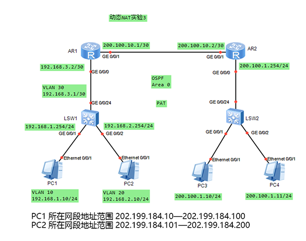

# 动态 NAT & Easy IP

???+ tip "提示"
    NAPT（Network Address Port Translation）技术，也称为PAT（Port Address Translation），是一种网络地址端口转换技术，主要用于解决内部网络设备通过有限的公网IP地址访问外部网络的问题‌‌。

## 配置命令

**nat** **address-group** *group-index* *start-address* *end-address* : 配置NAT地址池。

| 参数            | 参数说明               | 取值                          |
| --------------- | ---------------------- | ----------------------------- |
| *group-index*   | 指定NAT地址池索引号。  | 整数形式， 取值范围是0～255。 |
| *start-address* | 指定地址池的起始地址。 | 点分十进制格式。              |
| *end-address*   | 指定地址池的结束地址。 | 点分十进制格式。              |

**nat** **outbound** *acl-number* **address-group** *group-index* [ **no-pat** ] : 用来将一个访问控制列表ACL和一个地址池关联起来，表示ACL中规定的地址可以使用地址池进行地址转换。

| 参数                            | 参数说明                                                                                                      | 取值                             |
| ------------------------------- | ------------------------------------------------------------------------------------------------------------- | -------------------------------- |
| *acl-number*                    | 指定访问控制列表的索引值。                                                                                    | 整数形式，取值范围是2000～3999。 |
| **address-group** *group-index* | 表示使用地址池的方式配置地址转换，如果不指定地址池，则直接使用该接口的IP地址作为转换后的地址，即Easy IP特性。 | 整数形式，取值范围是0～255。     |
| **no-pat**                      | 表示使用一对一的地址转换，只转换数据报文的地址而不转换端口信息。                                              |                                  |

## 使用实例


配置动态NAT，只转换地址，不转换TCP/UDP端口。

```text title="AR1:"
[AR1]nat address-group 1 202.1.1.1 202.1.1.5
[AR1]acl 3000    # 也可以用基本acl
[AR1-acl-adv-3000]rule permit ip source 192.168.1.0 0.0.0.255
[AR1-acl-adv-3000]int g0/0/1
[AR1-GigabitEthernet0/0/1]nat outbound 3000 address-group 1 no-pat   # 如果没有`no-pat`就是`PAT`
[AR1]ip route-static 0.0.0.0 0 200.1.1.2    # 单出口网络，用默认路由
```

```text title="ISP:"
[ISP]ip route-static 202.1.1.0 24 200.1.1.1    # 使用静态路由指回，当然也可以用默认路由
```

配置NAPT，既转换地址，又转换TCP/UDP端口。



```text
不想写了，先空着
```

配置Easy IP，使用接口的IP地址做NAT转换。

```text
<Huawei> system-view
[Huawei] acl number 2001
[Huawei-acl-basic-2001] rule permit source 10.110.10.0 0.0.0.255
[Huawei-acl-basic-2001] quit
[Huawei] interface gigabitethernet 1/0/0 
[Huawei-GigabitEthernet1/0/0] nat outbound 2001
```
