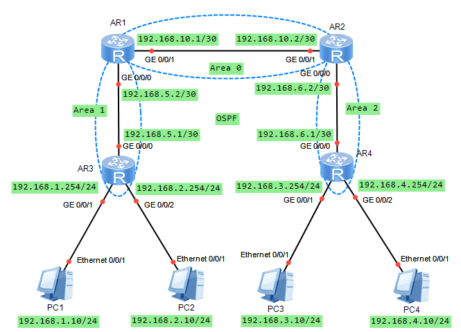

# 动态路由 （Dynamic routing）

## RIP (Routing Information Protocol)

### 配置命令

**rip** : 使能指定的RIP进程。

**version** { **1** | **2** } : 指定一个全局RIP版本。

| 参数 | 参数说明      | 取值 |
| ---- | ------------- | ---- |
| 1    | 指定RIP-1版本 |      |
| 2    | 指定RIP-2版本 |      |

**network** *network-address* : 对指定网段接口使能RIP路由。

| 参数              | 参数说明                                            | 取值             |
| ----------------- | --------------------------------------------------- | ---------------- |
| *network-address* | 指定使能RIP的网络地址。该地址必须是自然网段的地址。 | 点分十进制形式。 |

### 使用实例

```text
<Huawei> system-view
[Huawei] rip
[Huawei-rip-1]version 2 # 指定为 RIP 版本2
[Huawei-rip-1]network 192.168.10.0
```

## OSPF (Open Shortest Path First)

### 配置命令

**ospf** : 用来创建并运行OSPF进程。

**area** *area-id* : 用来创建OSPF区域，并进入OSPF区域视图。

| 参数      | 参数说明                                                 | 取值                                                                          |
| --------- | -------------------------------------------------------- | ----------------------------------------------------------------------------- |
| *area-id* | 指定区域的标识。其中区域号 *area-id* 是0的称为骨干区域。 | 可以是十进制整数或点分十进制格式。采取整数形式时，取值范围是 0～4294967295 。 |

**network** *network-address* *wildcard-mask* : 用来指定运行OSPF协议的接口和接口所属的区域。

| 参数              | 参数说明                                                                              | 取值             |
| ----------------- | ------------------------------------------------------------------------------------- | ---------------- |
| *network-address* | 接口所在的网段地址。                                                                  | 点分十进制格式。 |
| *wildcard-mask*   | IP地址的反码，相当于将IP地址的掩码反转（0变1，1变0）。例如0.0.0.255表示掩码长度24位。 | 点分十进制格式。 |


### 注意事项

- 区域的边界是路由器，不是链路。
- 一个网段（链路）只能属于一个区域，或者说每个运行OSPF的接口必须指明属于哪一个区域。
- 骨干区域负责区域之间的路由，非骨干区域之间的路由信息必须通过骨干区域来转发。
- 所有非骨干区域必须与骨干区域保持连通，骨干区域自身也必须保持连通。

### 使用实例



```text title="AR1:" hl_lines="5-8"
[AR1]ospf
[AR1-ospf-1]area 0
[AR1-ospf-1-area-0.0.0.0]network 192.168.10.0 0.0.0.3 # 这里是反掩码
[AR1-ospf-1-area-0.0.0.0]area 1
[AR1-ospf-1-area-0.0.0.1]network 192.168.5.0 0.0.0.3
```

```text title="AR3:" hl_lines="3-5"
[AR3]ospf
[AR3-ospf-1]area 1
[AR3-ospf-1-area-0.0.0.1]network 192.168.5.0 0.0.0.3
[AR3-ospf-1-area-0.0.0.1]network 192.168.1.0 0.0.0.255
[AR3-ospf-1-area-0.0.0.1]network 192.168.2.0 0.0.0.255
```

```text title="AR2:" hl_lines="4-8"
[AR2]ospf
[AR2-ospf-1]area 0
[AR2-ospf-1-area-0.0.0.0]network 192.168.10.0 0.0.0.3
[AR2-ospf-1-area-0.0.0.0]area 2
[AR2-ospf-1-area-0.0.0.1]network 192.168.6.0 0.0.0.3
```

省略其他
