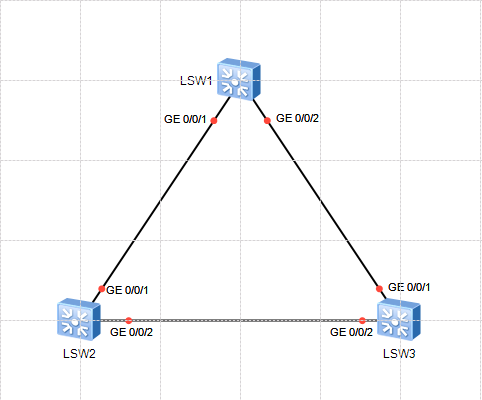

# STP 基础操作

## 配置命令

### STP 工作模式

**stp** **mode** { **mstp** | **rstp** | **stp** } : 用来配置交换设备的生成树协议工作模式。

| 参数     | 参数说明       | 取值 |
| -------- | -------------- | ---- |
| **mstp** | 指定MSTP模式。 |      |
| **rstp** | 指定RSTP模式。 |      |
| **stp**  | 指定STP模式。  |      |

### STP 设备优先级

**stp** **priority** *priority* : 用来配置交换设备在指定生成树中的优先级。

| 参数         | 参数说明                                                               | 取值                                                                         |
| ------------ | ---------------------------------------------------------------------- | ---------------------------------------------------------------------------- |
| **priority** | 指定交换设备的优先级数值。<br />优先级值越小，则交换设备的优先级越高。 | 整数形式，取值范围是0～61440，步长为4096，如0、4096、8192等。缺省值是32768。 |

**stp** **root** { **primary** | **secondary** } : 用来配置当前交换设备为指定生成树的根桥或备份根桥。

| 参数          | 参数说明                         | 取值 |
| ------------- | -------------------------------- | ---- |
| **primary**   | 指定配置为生成树的根桥设备。     |      |
| **secondary** | 指定配置为生成树的备份根桥设备。 |      |

### STP 端口开销

**stp** **cost** *cost* : 用来配置当前端口在指定生成树上的端口路径开销。

| 参数     | 参数说明           | 取值                                                                                                                                                                                                                  |
| -------- | ------------------ | --------------------------------------------------------------------------------------------------------------------------------------------------------------------------------------------------------------------- |
| **cost** | 指定端口路径开销。 | 取值范围由路径开销计算方法决定： <ul>  <li>使用华为计算方法时取值范围是1～200,000 </li>  <li>使用IEEE 802.1d-1998标准方法时取值范围是1～65535 </li>  <li>使用IEEE 802.1t标准方法时取值范围是1～200,000,000 </li></ul> |

## 注意事项

在 **eNSP** 中，默认使用 **IEEE 802.1t** 标准来计算端口开销。

**Ethernet** 端口为 **`200000`** , **GigabitEthernet** 端口为 **`20000`**。

## 使用实例



使用RSTP。

配置LSW1为根桥，LSW2为备份根桥，阻塞LSW1到LSW3的冗余链路来消除二层环路。

```text title="LSW1"
[LSW1]stp mode rstp
[LSW1]stp root primary # 配置 LSW1 为根桥
```

```text title="LSW2"
[LSW2]stp mode rstp
[LSW2]stp root secondary # 配置 LSW2 为备份根桥
```

```text title="LSW3"
[LSW3]stp mode rstp
[LSW3]int g0/0/1
[LSW3]stp cost 200000
# 将 LSW3 的 G0/0/1 端口路径开销改大，阻塞LSW1到LSW3的冗余链路来消除二层环路。
```
