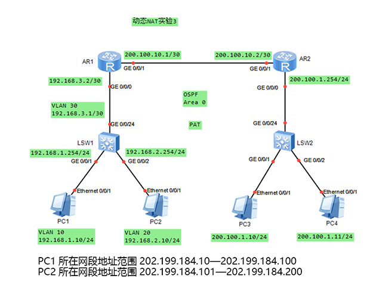

# 动态NAT (Dynamic Nat) & 端口地址转换 (Port Address Translation)

## 动态NAT (Dynamic Nat)


``` execline title="AR1:"
[AR1]nat address-group 1 202.1.1.1 202.1.1.5
[AR1]acl 3000    # 也可以用基本acl
[AR1-acl-adv-3000]rule permit ip source 192.168.1.0 0.0.0.255
[AR1-acl-adv-3000]int g0/0/1
[AR1-GigabitEthernet0/0/1]nat outbound 3000 address-group 1 no-pat   # 如果没有`no-pat`就是`PAT`
[AR1]ip route-static 0.0.0.0 0 200.1.1.2    # 单出口网络，用默认路由
```

``` execline title="ISP:"
[ISP]ip route-static 202.1.1.0 24 200.1.1.1    # 使用静态路由指回，当然也可以用默认路由
```

## 端口地址转换 (Port Address Translation)

!!! tip
    PAT也叫端口多路复用 (`OverLoad`)和网络地址端口转换 (`Network Address Port Translation`)



