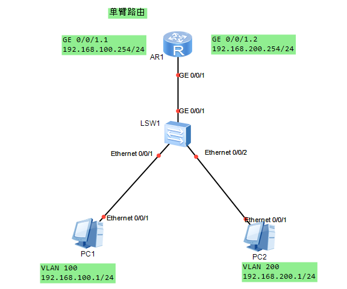

# VLAN间通信

## 三层交换机实现Vlan间通信


``` execline title="LSW1:" hl_lines="6-9"
[LSW1]vlan batch 100 200
[LSW1]int g 0/0/1
[LSW1-GigabitEthernet0/0/1]port link-type trunk
[LSW1-GigabitEthernet0/0/1]port trunk allow-pass vlan all // 也可以`vlan 100 200`
[LSW1-GigabitEthernet0/0/1]quit
[LSW1]interface Vlanif 100
[LSW1-Vlanif100]ip add 192.168.100.254 255.255.255.0
[LSW1-Vlanif100]int vlan 200
[LSW1-Vlanif200]ip add 192.168.200.254 24
```

``` execline title="LSW2:"
[LSW2]v b 100 200
[LSW2]int g 0/0/1
[LSW2-GigabitEthernet0/0/1]port link-type trunk
[LSW2-GigabitEthernet0/0/1]port trunk allow-pass vlan all
[LSW2-GigabitEthernet0/0/1]int e 0/0/1
[LSW2-Ethernet0/0/1]port link-type access
[LSW2-Ethernet0/0/1]port default vlan 100
[LSW2-Ethernet0/0/1]int e 0/0/2
[LSW2-Ethernet0/0/2]port link-type access
[LSW2-Ethernet0/0/2]port default vlan 200
```

## 单臂路由实现vlan间通信



``` execline title="LSW1:"
[LSW1]v b 100 200
[LSW1]int g 0/0/1
[LSW1-GigabitEthernet0/0/1]port link-type trunk
[LSW1-GigabitEthernet0/0/1]port trunk allow-pass vlan all
[LSW1-GigabitEthernet0/0/1]int e 0/0/1
[LSW1-Ethernet0/0/1]port link-type access
[LSW1-Ethernet0/0/1]port default vlan 100
[LSW1-Ethernet0/0/1]int e 0/0/2
[LSW1-Ethernet0/0/2]port link-type access
[LSW1-Ethernet0/0/2]port default vlan 200
```

``` execline title="AR1:" hl_lines="2-4"
[AR1]int g 0/0/1.1
[AR1-GigabitEthernet0/0/1.1]ip address 192.168.100.254 24
[AR1-GigabitEthernet0/0/1.1]dot1q termination vid 100
[AR1-GigabitEthernet0/0/1.1]arp broadcast enable 
[AR1-GigabitEthernet0/0/1.1]int g 0/0/1.2
[AR1-GigabitEthernet0/0/1.2]ip add 192.168.200.254 24
[AR1-GigabitEthernet0/0/1.2]dot1q termination vid 200
[AR1-GigabitEthernet0/0/1.2]arp broadcast enable
```
